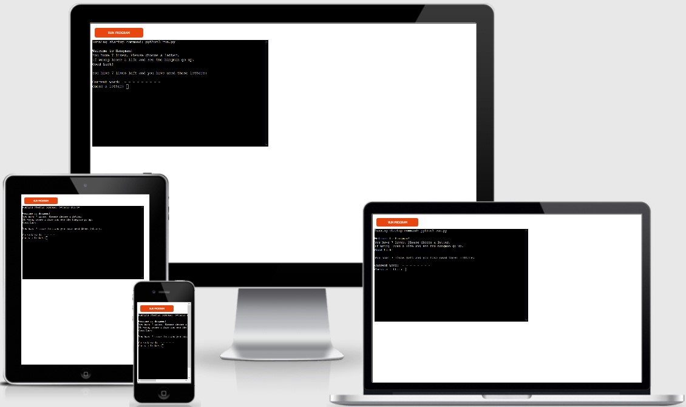
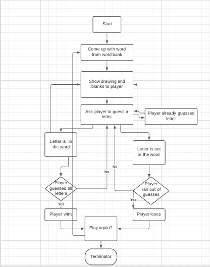
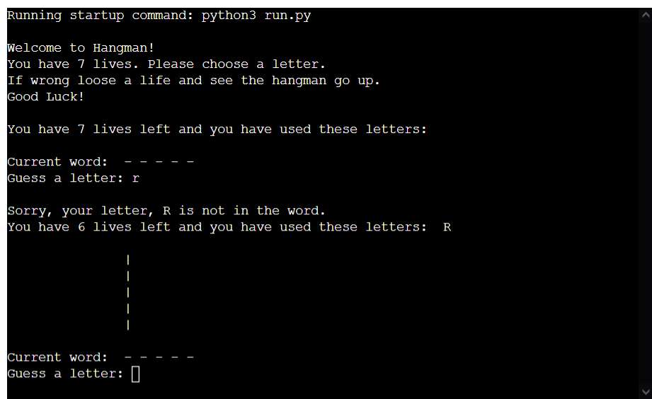
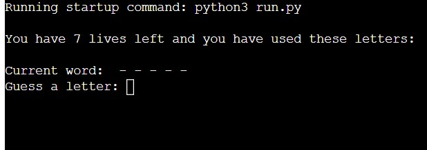
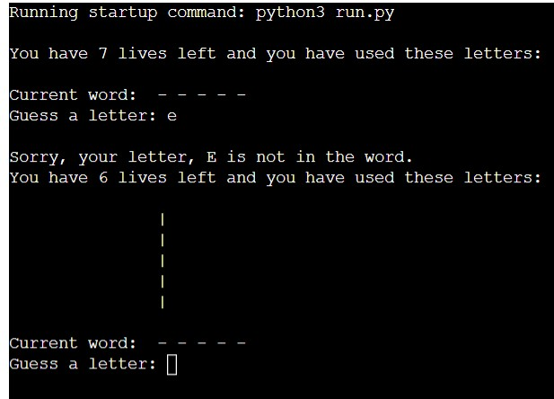
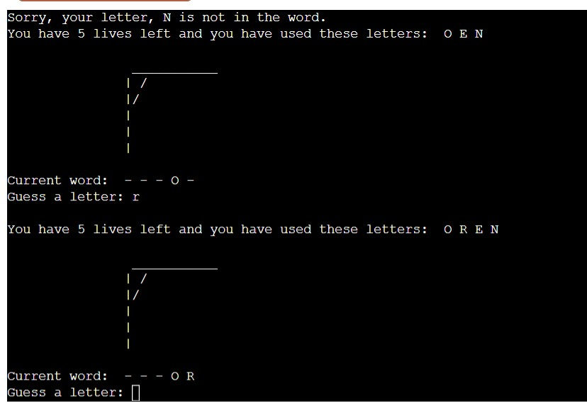
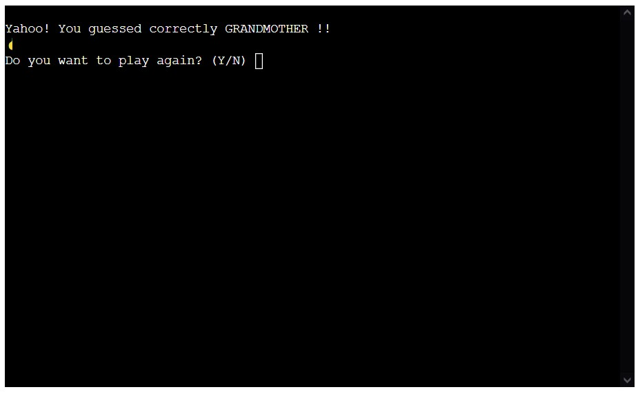

# Hangman
- Hangman is a Python Terminal game, which runs on a mock terminal in Heroku.
- Users guess letters from a word until they run out of lives or guess the word correctly.

## Lucid Chart

## How to Play
1. Guess a letter
2. If you get it right the letter it is put in the space. If it is wrong Hangman form starts to come up.
3. Keep guessing until either you guess the word and win or end up with a hangman and no lives left.

- 

## Existing Features
- _Random word generation_
- _Accepts user inputs_
- 
- _Keeps track of right and wrong guesses_
- 
- _Input validation and score checking_
- 
- _Clear Screen_
- _Start Again to make the game replayable_
- 

## User Stories:
- _First time Visitor Goals_
  - As a first time user of this site, I would like to be able to easily decifer the main purpose of the game
  - As a first time user, I would like to be able to easily navigate the game
  - As a first time user, I would like to see how many lives that I have left

## Languages Used:

- [Python](https://www.python.org/): used to built all of the Python functionality

## Frameworks, Libraries & Programs Used:

- [Git](https://git-scm.com): used to utilize the Gitpod terminal to commit to Git and Push to GitHub
- [GitHub](https://github.com/): used to store project code after being pushed from Git
- [GitPod](https://gitpod.io/): used as cloud based IDE for writing code
- [Lucid Charts](https://www.lucidchart.com/pages/): used to draw a chart of the hangman game process
- [Am I Responsive?](http://ami.responsivedesign.is/) Used on Readme to show how the application looks on different devices.

## Future Additions to page

- Mutiplayer function
- Ability to choose the length of the word
- A timer to make the guess be done within a certain time period.

## Testing

To view all testing, go to [TESTING.md](TESTING.md)

## Deployment

- The site was deployed to Heroku. I used the steps listed below to deploy. 
  -  Fork or clone this repository
      -  `git clone https://github.com/pattytonyoneill/hangman.git`
  -  Register in [Heroku.com](https://www.heroku.com)
  
  -  Create a new Heroku app. 
  -  Under "Settings" set buildback to **python**.
  -  Under "Settings" set buildback to **nodeJS**.
  -  Under "Settings" click "Reveal Config Vars", Set `PORT` to `8000`
  -  Link the app to the repository.
  -  Click on Deploy
    -  select github
    -  find repo
    -  click connect button
    -  enable automatic deployment
    -  deploy branch
    -  allow a few minutes for the app to build
    -  then it deploys with live link

The live link can be found here - https://hangman44444.herokuapp.com/

## Credits
-  [12 Beginner Python Projects](https://www.youtube.com/watch?v=8ext9G7xspg)- I watched this to help me decide on the game I would make.  I used the word list that she obtained from stack overflow and used the idea of the hangman visual she made in video.  
-  [wordlist](https://www.randomlists.com/data/words.json)- This is the random list that I used that was mentioned in the tutorial.
-  [stack overflow](https://stackoverflow.com/questions/594273/how-to-pick-a-random-english-word-from-a-list) This is the article that the word list was mentioned in.

### Code
- _Readme used sample readme from code institute as a model. [Github](https://github.com/Code-Institute-Solutions/readme-template/blob/master/README.md)_

### Content
- _All content written by the developer._

### Acknowlegements
- _My Mentor for his help and feedback._
- _Tutor support at Code Institute_
- _Family for help with help and feedback on website as a use_