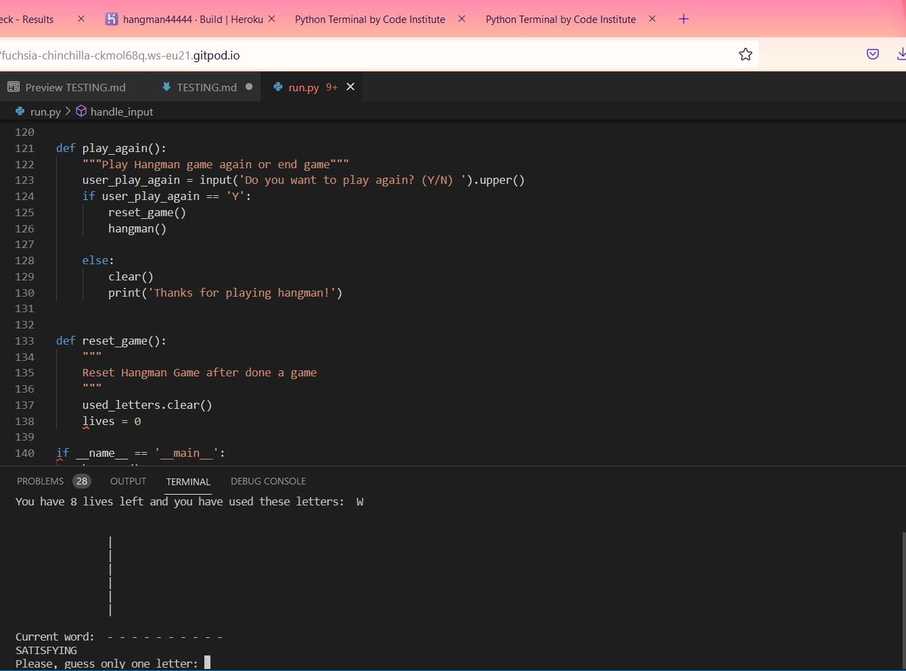

Return back to [README.md](README.md)

## Remaining Bugs
- No bugs are remaining that I am aware of.

## Bugs
- Getting while loop to work correctly. First, I took a couple of days away from the code. Next I rewrote this several times until I got it right.

- When I deployed my code it did not deploy correctly.  I had to redo pip3 line due to a typo on that line and it was right immediately after that

- When I added a clear message my welcome message was not showing.  I fixed this by putting clear under individual statements in the code so it clears.

- When I added an update_game function it was just ending game instead of asking if you want to play again.  I just reworked code until I fixed it.

- When I added the handle_input function it was repeating over and over "You have 9 lives left and you have used these letters:"  I just had to rework the code until I fixed it. 

- When doing second puzzle wasn't deleting the letters used in last puzzle so I had to add reset_game function to fix this error.

## User Stories testing:
- _First time Visitor Goals_
  - As a first time user of this site, I would like to be able to easily decifer the main purpose of the game
  - As a first time user, I would like to be able to easily navigate the game
  - As a first time user, I would like to see how many lives that I have left

## Testing

- I have manually tested this project by doing the following:
    - Given invalid inputs such as a number and a repeat of previous letter used.
    - 
    - Tested in my local terminal as well as on Heroku.
    - 
    - 

## Validator Testing
-  Pep8
     - 
